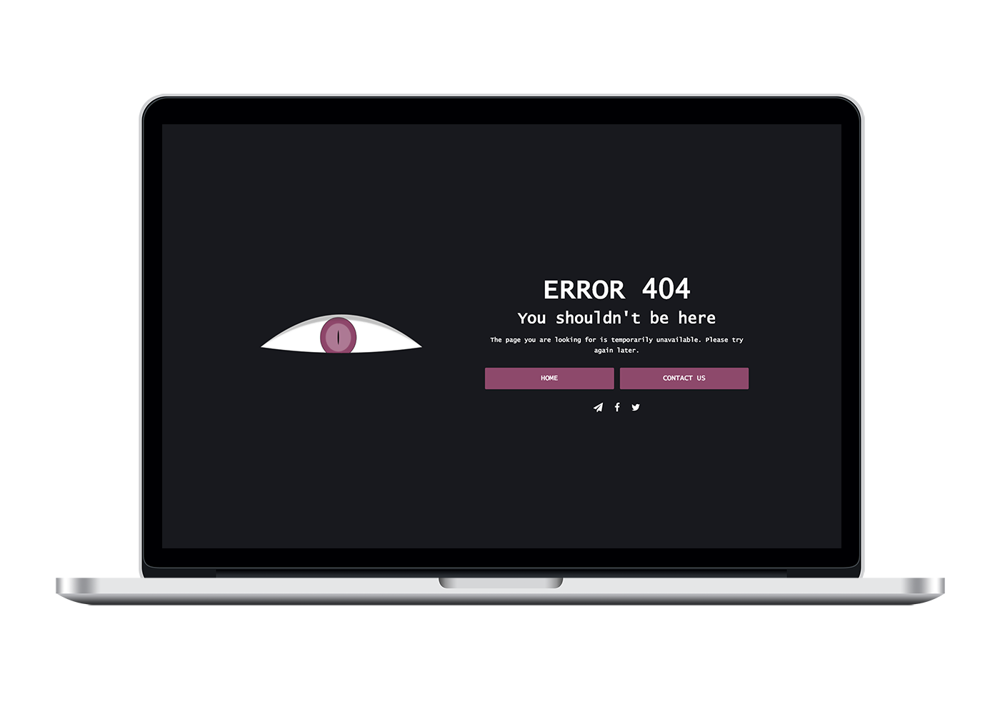

# THE EYE — Responsive Animated HTML5 Template

The eye is an efficient 404 responsive Page. Clean, classy and elegant for every creative people, corporates, agency, e-commerce, business, portfolio etc… 
http://rogatnev-nikita.github.io/the-eye-404/html/404.html

<h4>Summary</h4>
<ul>
  <li>High Resolution: Yes</li>
  <li>Compatible Browsers: IE11, Firefox, Safari, Opera, Chrome, Edge</li>
  <li>Files Included: HTML Files, CSS Files, JS Files, PHP Files</li>
  <li>Columns: 1</li>
  <li>Documentation: Well Documented</li>
  <li>Layout: Responsive</li>
  <li>Category: Specialty Pages / 404 Pages</li>
  <li>Tags: error, error page, creative, clean, modern, minimal, animated, responsive, dark, oh no, oops</li>
</ul>

<h4>File structure</h4>
    +-- scripts /
    ¦	+-- eyes.js
    ¦	+-- jquery.js
    ¦	+-- main.js
    +-- styles /
    ¦    +-- main.css
    +-- 404.html
    +-- mail.php
    
<h4>Sources & Credits</h4>
<ul>
  <li>
    <strong>Font Awesome</strong> 
    font-awesome.min.css v4.5.0 
    Copyright © Dave Gandy 
    Licensed under MIT (http://fontawesome.io/license/)
  </li>                
  <li>
    <strong>jQuery</strong> 
    jquery.min.js v3.0.0-beta1 
    Licensed under MIT (https://jquery.org/license/)
  </li>
  <li>
    <strong>eyes.js</strong> 
    Copyright (C) 2011 Hakim El Hattab, (http://hakim.se)
  </li>
</ul>
